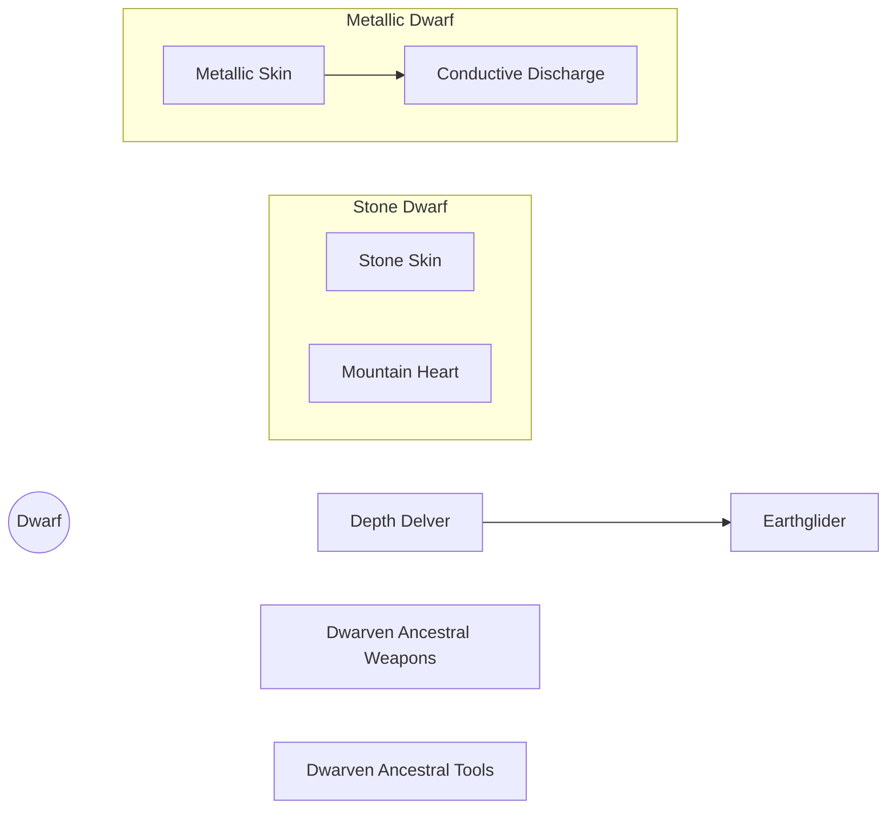

# Dwarven

The Dwarves delved deep into the earth, and formed connections with the powerful elemental spirits they found there.

## Base Traits

* Default Size: Medium or Small
* Base Speed: 4 cells

## Dwarven Traits

### Trait: Dwarven Ancestral Weapons

* Repeatable
* +1 when wielding Weapons with the _Dwarven_ property

### Trait: Dwarven Ancestral Tools

* Repeatable
* +1 when wielding tools with the _Dwarven_ property

### Trait: Depth Delver

* Darkvision: You treat Dim Light the same as Bright Light, and Darkness the same as Dim Light.

### Trait: Earthglider

* You gain a Burrow Speed equal to your move speed through soil, mud, clay, and other relatively soft or loosely-packed firmament. This movement is blocked by rock, stone, wood, metal, and any other impermeable surface.

## Stone Dwarven Trait Tree

### Trait: Stone Skin

* Repeatable
* +1 Resistance (Physical, Elemental)

### Trait: Mountain Heart

* Repeatable
* +1 Resistance (Blight)
* +1 Defense against Blight Effects

## Metallic Dwarven Trait Tree

### Trait: Metallic Skin

* Repeatable
* +1 Resistance (Physical)

### Trait: Conductive Discharge

* Prereq: Metallic Skin >=2
* +1 Resistance (Lightning) per Metallic Skin
* When hit with an attack that deals Lightning Damage, you can do the following:
	* As a reaction, make a Touch Attack vs. Agility Defense, redirecting the lightning damage (after Resistance) into that target. If you fail, you take the damage as normal.
