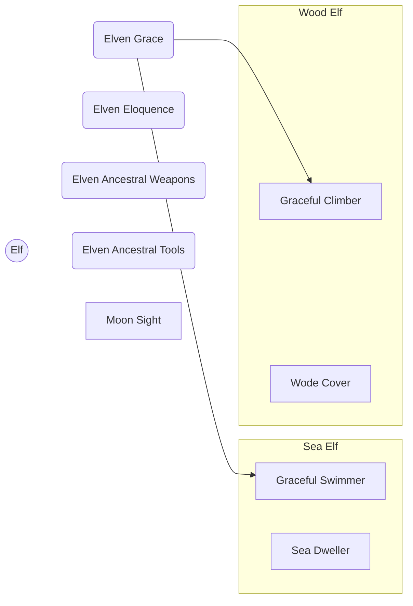

# Elven

The Elves developed in close proximity with powerful nature spirits, and as a result have developed deep connections with the natural, living world.

## Base Traits

* Default Size: Medium
* Base Speed: 5 cells

## Elven Trait Tree

### Trait: Elven Ancestral Weapons

* Repeatable
* +1 when using Weapons with the _Elven_ property.

### Trait: Elven Ancestral Tools

* Repeatable
* +1 when wielding tools with the _Elven_ property

### Trait: Elven Grace

* Repeatable
* +1 to Acrobatics and Athletics

### Trait: Elven Eloquence

* Repeatable
* +1 to Persuasion and Performance

### Trait: Moon Sight

* Moonlight Vision: You can see in Moonlight, no matter how dim, as if it were Bright light.

## Wood Elf Trait Tree

### Trait: Wode Cover

* +5 to Stealth in Forests, Swamps, and in or around Trees

### Trait: Graceful Climber

* Prereq: Elven Grace >=2
* You gain a Climb Speed equal to your Base Speed

## Sea Elf Trait Tree

### Trait: Sea Dweller

* You can breathe underwater, and don't take penalties to actions taken underwater

### Trait: Graceful Swimmer

* Prereq: Elven Grace >=2
* You gain a Swim Speed equal to your Base Speed
