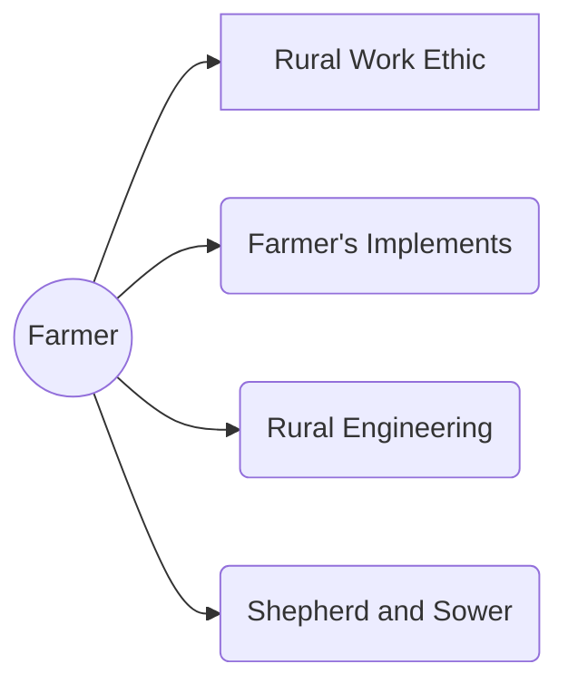

# Farmer

You come from a rural culture, surrounded by other farmers, laborers, tradesfolk, and the wilderness beyond.

## Farmer Cultural Traits

### Trait: Shepherd and Sower

* Repeatable
* +1 Proficiency to Animal Handling and Nature

### Trait: Rural Work Ethic

* +1 Will

## Trait: Farmer's Implements

* Repeatable
* +1 Proficiency with Scythes, Sickles, Hammers, and Axes

## Trait: Rural Engineering

* Repeatable
* +1 Proficiency with Crafting
