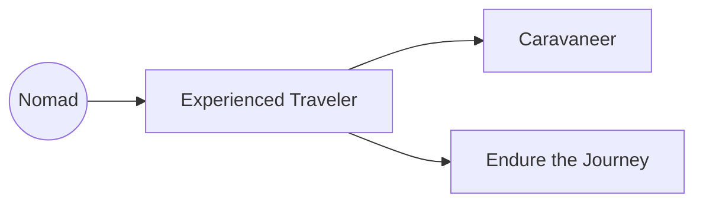

# Nomad

You are a wanderer, traveler, or hermit. Perhaps you come from a nomadic people, or set out on your own at a young age. In either case, you've travelled far and know both the joys and pains the road can bring.

## Nomad Traits

### Trait: Experienced Traveler

* Repeatable
* +1 Proficiency in Survival and Nature

### Trait: Caravaneer

* Prereq: Experienced Traveler >=1
* Repeatable
* +1 Proficiency in Animal Handling and Land Vehicles

### Trait: Endure the Journey

* Prereq: Experienced Traveler >=1
* +1 Constitution, +2 Proficiency in Endurance
